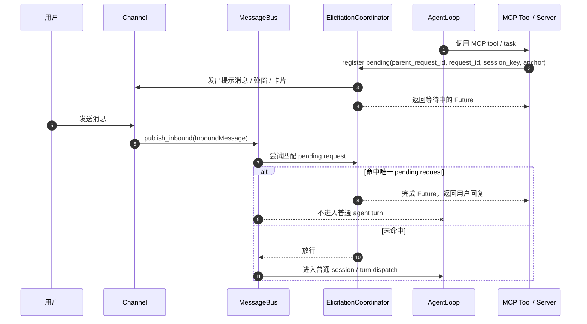

# MCP Elicitation 防串台方案

## Summary
MCP elicitation 不再依赖“当前 session 的下一条消息”，而是改成 request 级别回填。
每个 elicitation 都有独立 `request_id`，入站消息先经过协调器匹配，命中时只唤醒对应的 pending request，不命中才进入普通 `AgentLoop`。
对于同一个 MCP request 内的多次 elicitation，client 需要区分“父 request”和“子 elicitation instance”：v1 允许同一父 request 串行发起多次 elicitation，但禁止在前一个未完成时并发发起第二个 active elicitation。
当前还需要处理另一个问题：只按 thread / session 命中 pending elicitation 时，普通聊天消息可能被误吞。最小改动版通过“匹配成功后先做内容校验，再决定是否消费”来降低误吞概率。

## Flow
1. MCP server 触发 elicitation。
2. client 为当前 MCP 调用绑定一个 `parent_request_id`，并为本次提问创建一个独立的 `request_id`。
3. client 创建 `PendingElicitation`，记录 `parent_request_id + request_id + session_key + anchor + timeout`。
4. client 发出提示消息，并把 `request_id` 写入 `OutboundMessage.metadata._mcp_elicitation`。
5. 如果同一 `parent_request_id` 下已经有未完成的 active elicitation，则拒绝新的并发注册，避免同一父 request 内部歧义。
6. 用户回复进入 `MessageBus` 后，`AgentLoop` 先交给 `ElicitationCoordinator`。
7. 如果消息能唯一匹配到某个 pending elicitation instance，就消费它并完成对应 Future。
8. 如果不能匹配，就按原逻辑进入普通 session / turn dispatch。

## Matching Rules
- Feishu 等带 thread 语义的渠道，优先使用 `thread_id / root_id / parent_id / message_id` 做锚点匹配。
- 只有在“唯一匹配”时才自动消费，歧义直接返回未命中。
- 没有可靠锚点的渠道，保守降级为同一 session 单活跃 elicitation。
- 如果同一 session 已有活跃 pending request，新的 request 直接拒绝，避免串台。

## Avoid Swallowing Normal Messages
- 当前问题：
  - 只要会话里存在一个可唯一命中的 pending elicitation，用户原本想继续聊天的普通消息也可能被优先当作 elicitation reply 消费掉。
  - 同一 thread / session 下的短文本尤其危险，比如 `好的`、`继续`、`不是这个`。
- 最小改动方案：
  - `match()` 继续只负责找唯一 pending candidate。
  - `consume()` 在真正 `set_result()` 前先检查 `reply_spec`，只有内容也满足该 elicitation 的预期格式时才消费。
- `reply_spec` 规则：
  - `url` 模式：只接受 `confirm / cancel / decline / yes / no / accept / reject` 一类明确确认词。
  - `form` 模式：
    - 合法 JSON object 可消费。
    - 单字段 schema 允许单值纯文本消费。
    - 多字段 schema 下，自由文本不消费，放行给普通 agent turn。
- 目标：
  - 显著降低误吞普通消息的概率。
  - 不引入新的 UI 协议，不改变现有 channel 输入模型。

## Multiple Elicitations In One Request
- 这里需要区分两层标识：
  - `parent_request_id`：同一个 MCP tool call / task / conversation branch。
  - `request_id`：该父 request 下某一次具体的 elicitation instance。
- 同一父 request 下的多次 elicitation，v1 只支持串行：
  - 第一次 elicitation 完成后，原 MCP 协程可以继续发起第二次。
  - 第二次会拿到新的 `request_id`，并可记录 `sequence=2`。
- 同一父 request 下不支持并发 active elicitation：
  - 也就是前一个 elicitation 还没完成时，又抛出第二个。
  - 这在 client 侧会立刻产生歧义，因为两次提问共享同一个 request 上下文、同一个 thread，通常还是同一段对话锚点。
  - 如果没有额外 UI 协议或强制选择器，用户的一条回复很难知道该回给哪一个。
  - 所以 v1 最稳的策略不是支持它，而是禁止同一父 request 下同时存在多个 active elicitation。
- 路由时始终命中子 elicitation instance，而不是父 request 本身；父 request 只用于分组、顺序控制和生命周期管理。

## Tests
- 协调器单测：
  - 唯一匹配会消费 pending request。
  - 歧义匹配不会自动命中。
  - 命中 pending 但内容不满足 `reply_spec` 时，不消费。
  - 超时会清理 pending request。
  - 同一父 request 下前一个 active elicitation 未结束时，第二个注册会被拒绝。
- 回调单测：
  - 发起 elicitation 时会注册 `request_id`。
  - 同一父 request 串行两次 elicitation 时，第二次会生成新的 child `request_id`。
  - 回复命中后返回对应 `ElicitResult`。
  - `url` 模式下普通句子不会被消费。
  - `form` 模式下，多字段 schema 的普通自然语言不会被消费。
  - timeout / cancel 只影响当前 request。
- 路由回归：
  - 命中 pending 的消息不会进入普通 agent turn。
  - 未命中的消息保持原行为。

## Assumptions
- 本期只做 client 侧防串台，不改 MCP server 协议。
- `input_required` 仍然不在本期范围。
- 不引入新的交互 UI 协议来让用户手动选择“这条回复要回给同一父 request 下的哪一个 elicitation”。
- WebUI 弹窗锁输入可以作为后续 UX 增强，但不作为唯一防串台手段。
