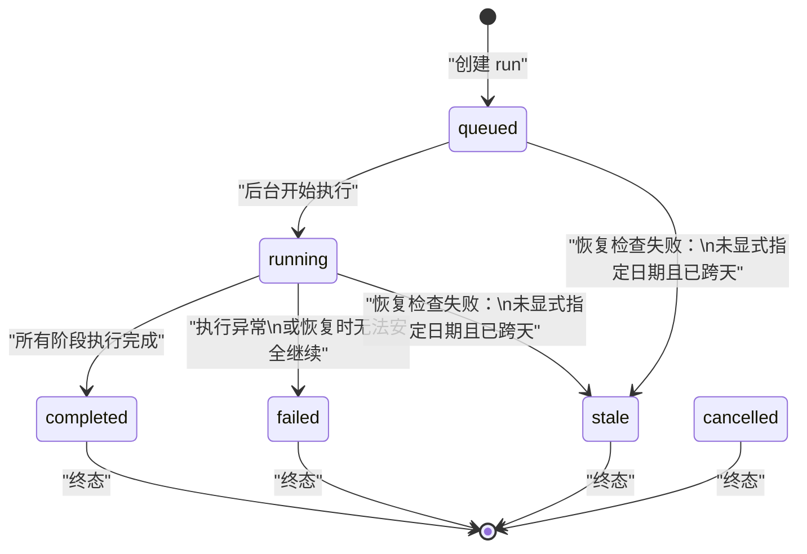
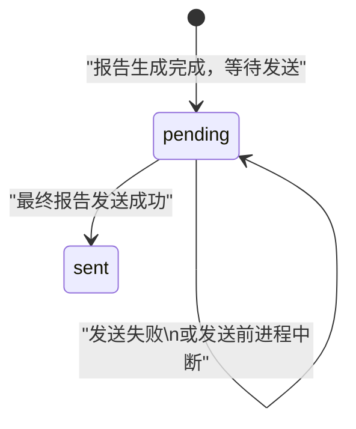

# `/stock-report` 持久化运行方案

## Summary

本方案为 `nanobot` 中的 `/stock-report` 命令增加一层最小可落地的持久化运行能力，目标是：

- 用户触发命令后立即收到“任务已受理”的响应，而不是同步等待完整报告
- 选股报告按阶段持久化执行状态，网关重启或崩溃后可以从最近已完成阶段继续
- 最终报告异步回投到原会话，避免用户在长运行过程中丢失结果
- 第一版沿用 workspace 文件存储风格，不引入 SQLite 或通用工作流引擎
- 显式指定 `trade_date` 的 run 视为历史数据查询任务，可跨天自动恢复
- 未显式指定 `trade_date` 的 run 视为当日语义任务，跨天后不自动恢复

当前 `cmd_stock_report()` 会直接 `await runner.run_daily_stock_selection(...)`，而
`StockSelectionSubagentOrchestrator` 只负责编排阶段逻辑与 Langfuse 观测，不保存执行实例、
阶段检查点或恢复点。因此本方案新增一个仅面向 `/stock-report` 的 durable job 层。

## 背景

### 当前执行链

当前 `/stock-report` 的执行路径为：

1. `cmd_stock_report()` 解析 `<strategy> [YYYY-MM-DD]`
2. 命令层直接调用 `runner.run_daily_stock_selection(strategy_name, trade_date)`
3. orchestrator 顺序执行：
   - `stock-screening`
   - `news-filter`
   - `market-scoring`
   - `merge`
4. 命令层同步返回最终报告文本

该实现的问题是：

- 运行期间如果网关重启，整份报告任务丢失
- 已完成阶段没有持久化，恢复时只能整份重跑
- 用户侧必须同步等待，不适合长时间运行任务
- 最终结果投递没有交付幂等语义

### 目标

- 为 `/stock-report` 引入显式执行实例
- 在阶段边界持久化输出，避免恢复时重复执行已完成阶段
- 支持启动恢复未完成任务
- 保持 `DailySelectionReport` 对外结构不变

### 非目标

- 第一版不抽象成全局通用 workflow runtime
- 不恢复任意时刻的协程、subagent 或 shell 进程内存现场
- 不引入 SQLite
- 不为所有工具统一建设 effect log，仅保证最终报告投递幂等

## 设计概览

### 用户交互

`/stock-report` 的用户体验调整为：

1. 用户发送 `/stock-report <strategy> [YYYY-MM-DD]`
2. 系统立即返回“任务已开始，完成后会自动发送到当前会话”
3. 后台异步执行 durable run
4. 完成后将最终报告发送回原频道 / 原会话

### 核心思路

引入一个 `/stock-report` 专用 `StockReportRuntime`：

- 创建并持久化 `StockReportRun`
- 按阶段推进 orchestrator
- 每个阶段成功后立即落盘结构化 artifact
- 启动时扫描 `queued/running/waiting_retry` 的 run 并恢复
- 完成后异步投递最终报告，并记录 `delivery_status`

### 总体架构

```text
/stock-report
  -> cmd_stock_report
  -> StockReportRuntime.enqueue()
  -> 持久化 run 文件
  -> asyncio 后台执行
  -> 分阶段调用 StockSelectionSubagentOrchestrator
  -> 每阶段写 checkpoint/artifact
  -> 完成后发送最终报告
```

## 日期语义与恢复规则

`/stock-report` 的日期来源会直接决定重启后是否允许自动恢复：

- `/stock-report B1 2026-07-01` 属于历史查询 run
- `/stock-report B1` 属于当日语义 run
- 历史查询 run 在重启后继续按保存的 `strategy_name + trade_date` 恢复
- 当日语义 run 如果跨天恢复，默认不自动继续执行

日期来源在 run 创建时确定，并持久化为 `date_source`：

- `date_source=explicit`：用户显式指定日期，视为历史数据查询任务，可进入自动恢复候选集
- `date_source=implicit_default`：用户未显式指定日期，`trade_date` 来自受理时默认解析，视为当日语义任务；若恢复时已跨天，则不自动恢复
- 恢复时永远使用持久化的解析后参数，不重新基于恢复当天重新推导 `trade_date`

示例：

- `/stock-report B1` 于 `2026-07-01` 创建，若在 `2026-07-02` 重启恢复，则不自动继续
- `/stock-report B1 2026-07-01` 于 `2026-07-01` 创建，若在 `2026-07-02` 重启恢复，则仍按 `2026-07-01` 历史任务恢复

## Durable Run 模型

建议新增一个轻量执行实例模型 `StockReportRun`，字段至少包括：

- `run_id`
- `session_key`
- `channel`
- `chat_id`
- `strategy_name`
- `trade_date`
- `date_source`
  - `explicit`
  - `implicit_default`
- `requested_at`
- `status`
  - `queued`
  - `running`
  - `waiting_retry`
  - `completed`
  - `failed`
  - `stale`
  - `cancelled`
- `current_stage`
  - `stock-screening`
  - `prepare-news-filter-inputs`
  - `news-filter`
  - `prepare-market-scoring-inputs`
  - `market-scoring`
  - `merge`
  - `finalize`
- `stage_statuses`
- `artifacts`
- `partial_failures`
- `delivery_status`
  - `pending`
  - `sent`
- `error`
- `created_at`
- `updated_at`

`date_source` 用于决定 run 是否允许跨天自动恢复。该字段在 run 创建时确定，后续不可修改。

### 状态流转图



### 投递状态流转图



### 存储方式

沿用 workspace 文件存储，建议目录如下：

```text
<workspace>/stock-report/
  runs/
    <run_id>.json
  index.jsonl
```

说明：

- `runs/<run_id>.json` 保存单个 durable run 的完整状态
- `index.jsonl` 仅用于加速扫描和排障；不是恢复唯一真相源
- 单文件写入保持与 session/cron 类似的原子写风格

### 完成后清理策略

run 完成后不立即删除持久化数据。最终状态、阶段 artifact 和渲染后的报告文本需要短期保留，用于补发结果、排查失败和解释报告来源。

第一版采用较短 TTL：

- `completed` 且 `delivery_status=sent`：保留 3 天
- `failed`：保留 3 天
- `stale`：保留 2 天
- `cancelled`：保留 2 天
- `queued` / `running` / `waiting_retry`：不按 TTL 自动删除
- `completed` 且 `delivery_status=pending`：不删除，必须先补发或人工处理

清理由 `StockReportRuntime.cleanup_finished_runs()` 执行，可在 gateway 启动时和每日定时任务中触发。清理只删除达到 TTL 的终态 run 文件；`index.jsonl` 第一版不强制重写，可在列表或扫描时忽略已不存在的 run。

## 阶段化执行与检查点

### 阶段定义

第一版保留 7 个显式 checkpoint 边界：

1. `stock-screening`
2. `prepare-news-filter-inputs`
3. `news-filter`
4. `prepare-market-scoring-inputs`
5. `market-scoring`
6. `merge`
7. `finalize`

`prepare-news-filter-inputs` 和 `prepare-market-scoring-inputs` 也是 durable checkpoint。它们会访问外部新闻、行情或技术数据，并产出后续 LLM 阶段的输入；这些输入一旦准备完成，就必须作为 artifact 保存。

### 持久化边界

每个阶段遵循同一规则：

1. 阶段开始前写入：
   - `status=running`
   - `current_stage=<stage>`
   - `stage_statuses[stage]=running`
2. 阶段成功后写入：
   - `stage_statuses[stage]=completed`
   - 对应 `artifact`
   - 更新 `partial_failures`
3. 阶段失败后写入：
   - `status=failed`
   - `stage_statuses[stage]=failed`
   - `error`

### Artifact 设计

建议以结构化 JSON 保存阶段产物：

- `stock-screening`
  - `screened_items`
- `prepare-news-filter-inputs`
  - `review_items`
  - `auto_allowed_items`
- `news-filter`
  - `reviewed_items`
  - `news_filter_failures`
- `prepare-market-scoring-inputs`
  - `scoring_items`
- `market-scoring`
  - `scored_items`
  - `market_scoring_failures`
- `merge`
  - `selected_stocks`
  - `partial_failures`
- `finalize`
  - `report_json`
  - `rendered_report_text`

恢复时只要某阶段状态已经是 `completed`，就直接读取对应 artifact，跳过该阶段，推进到下一阶段。

对于准备阶段，恢复时必须优先复用已保存 artifact。只有在显式日期 run 且数据源支持按保存的 `trade_date` 重建同一语义输入时，才允许重新执行准备阶段。

### 历史数据约束

显式日期 run 虽然允许跨天自动恢复，但实现上必须保持历史数据语义一致：

- 后续阶段必须使用 `trade_date` 对应的历史或可重放数据
- 不允许在恢复时将“当前最新行情”或“当前最新新闻”混入同一 run
- 新闻查询、行情快照、技术指标准备等外部数据结果必须先作为准备阶段 artifact 持久化
- 恢复时若准备阶段 artifact 已完整，必须直接复用，不能重新请求外部实时数据
- 恢复时若准备阶段 artifact 缺失，只能按保存的 `trade_date` 重建历史输入
- 如果某个阶段当前实现无法保证历史数据语义一致，则该 run 不应自动恢复，应标记为 `failed` 或 `stale` 并提示用户重新发起

## 对现有组件的改动

### `cmd_stock_report`

命令层从“同步执行”改为“创建 durable run + 立即返回受理消息”：

- 保留参数校验逻辑
- 配置缺失或参数错误时仍立即返回错误，不创建 run
- 参数合法时：
  - 创建 run
  - 调度后台任务
  - 返回包含 `run_id` 的受理消息

### `StockSelectionSubagentOrchestrator`

orchestrator 需要支持“阶段可独立推进”，但不要求一开始重构成通用 DAG。

推荐改造方向：

- 保留 `run_daily_stock_selection()` 作为同步兼容入口
- 新增阶段化执行能力，例如：
  - `run_stock_screening(...)`
  - `prepare_news_filter_inputs(...)`
  - `run_news_filter(...)`
  - `prepare_market_scoring_inputs(...)`
  - `run_market_scoring(...)`
  - `merge_stage_outputs(...)`
  - `finalize_report(...)`

这样 runtime 才能：

- 从单阶段恢复
- 重用已有 prompt、校验和汇总逻辑
- 避免恢复时重新执行已经完成的 subagent 阶段

### Gateway 生命周期

在 gateway 启动时注册并启动 `StockReportRuntime`：

- `start()`
- `resume_incomplete_runs()`
- `stop()`

其生命周期与 `cron`、`heartbeat` 同级，但职责限定在 `/stock-report`。

## 恢复策略

### 启动恢复

网关启动时：

1. 扫描全部 run 文件
2. 找出状态为 `queued/running/waiting_retry` 的 run
3. 执行恢复前 guard
4. 将可恢复 run 重新加入后台调度
5. 按最后一个 `completed` 阶段之后继续

对于崩溃时停留在 `running` 的 run，不尝试恢复原内存任务，而是视为“需从最近完成阶段继续”。

### 恢复前 guard

恢复前先做两步判定：

1. 参数冻结检查
   - `strategy_name`、`trade_date`、`date_source` 必须存在且合法
   - 恢复时只读这些持久化字段，不重新解析原始命令
2. 日期语义检查
   - `date_source=explicit`：允许继续恢复
   - `date_source=implicit_default` 且未跨天：允许继续恢复
   - `date_source=implicit_default` 且已跨天：不自动恢复，标记为 `stale` 或 `failed`

恢复执行只基于 run 创建时冻结的解析后参数。即使原始命令文本仍保存在 run 中，也不能在恢复时重新按当前日期解释它。

### 投递恢复

如果 run 已 `completed`，但 `delivery_status != sent`：

- 只重试最终报告发送
- 不重新执行任何计算阶段

这也是第一版最关键的交付幂等保障。

## 失败与重试语义

第一版保持保守，不做复杂自动重试：

- 参数错误、策略错误、服务未配置：
  - 命令层立即失败
  - 不创建 run
- 阶段整体异常：
  - run 标记为 `failed`
  - 保存 `current_stage` 和 `error`
- 进程中断：
  - 下次启动自动恢复
- 日期语义过期：
  - run 标记为 `stale`
  - 不自动恢复

### `partial_failures` 的解释

现有 `partial_failures` 仍属于业务结果的一部分，不等于 durable run 失败。

例如：

- 个别新闻候选无法判定
- 个别股票评分失败

这些情况仍应进入最终 `DailySelectionReport.partial_failures`，但只要阶段整体可继续，run 不应被标记为 `failed`。

### `stale` 的解释

`stale` 表示任务并非执行异常，而是恢复时日期语义与 run 类型不再匹配。

未显式指定日期的 run 跨天后，推荐标记为 `stale`。这能区分“执行出错”和“当日语义任务已经过期”，也能避免系统静默把旧任务按新日期继续运行。

## 测试方案

### 命令层

- `/stock-report` 有效参数时，立即返回受理消息而非最终报告
- 缺参数、非法日期、未知策略时，不创建 durable run
- orchestrator/service 未配置时，不创建 durable run

### 持久化

- 创建 run 后写入 `runs/<run_id>.json`
- 每阶段完成后更新 `current_stage`、`stage_statuses` 与 artifact
- run 完成后保存最终报告快照

### 恢复

- `stock-screening` 完成后模拟退出，恢复后从 `news-filter` 继续
- `news-filter` 完成后模拟退出，恢复后不重跑 `stock-screening`
- `prepare-news-filter-inputs` 完成后模拟退出，恢复后复用 `review_items` 和 `auto_allowed_items`
- `prepare-market-scoring-inputs` 完成后模拟退出，恢复后复用 `scoring_items`
- `market-scoring` 完成、最终消息未发送时模拟退出，恢复后只补发结果
- 启动扫描遇到旧 `running` 状态 run 时，能够转为恢复执行
- `/stock-report B1 2026-07-01` 创建后跨天恢复，仍按 `2026-07-01` 继续
- `/stock-report B1` 创建后跨天恢复，不自动继续，run 标记为 `stale` 或 `failed`
- 恢复时不会重新按当前日期覆盖已保存的 `trade_date`
- 显式日期恢复路径下，数据适配层收到的仍是保存的历史日期参数
- 准备阶段 artifact 已存在时，恢复路径不重新查询新闻、行情或技术数据

### 结果一致性

- 无中断时，最终报告内容与当前同步实现保持等价
- 有 `partial_failures` 时，恢复前后最终报告结构一致
- 恢复时跳过已完成阶段，不重复执行对应阶段 subagent

## 实施顺序

建议按以下顺序落地：

1. 新增 `StockReportRun` 模型与文件存储
2. 新增 `StockReportRuntime`
3. 将 `cmd_stock_report` 改为 enqueue 模式
4. 将 orchestrator 拆成可恢复的阶段执行接口
5. 增加启动恢复与最终消息补发
6. 补齐 durable run 与恢复测试

## Assumptions

- 第一版只针对 `/stock-report`
- 持久化载体采用 workspace 文件，不引入 SQLite
- 不做通用 effect log，只保证最终报告投递幂等
- 不改变 `DailySelectionReport` 对外数据结构
- 用户侧主要变化是从同步等待切换到后台异步完成
- 显式日期任务表示历史数据查询任务，可以跨天恢复
- 未显式日期任务表示当日语义任务，跨天后不自动恢复
- 恢复执行只基于持久化的解析后参数，不基于恢复时系统日期重新解释命令
